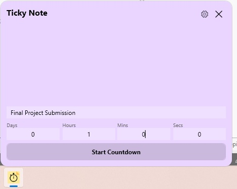
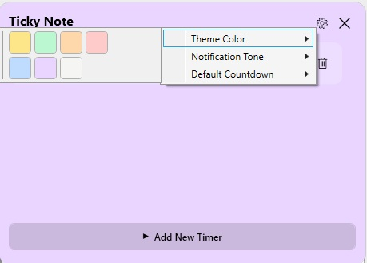
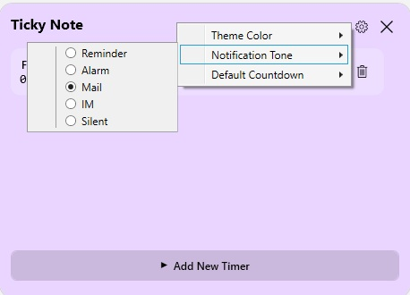
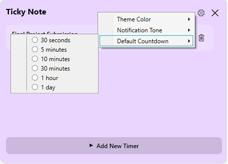
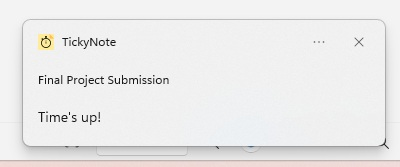

# TickyNote

A modern, lightweight countdown timer app for Windows built with WPF and .NET 10.

  

## Features

- **Multiple Timers** - Create and manage multiple countdown timers simultaneously
- **Customizable Duration** - Set timers with days, hours, minutes, and seconds
- **Toast Notifications** - Get notified when timers complete
- **Theme Colors** - Choose from 7 beautiful color themes (Yellow, Green, Orange, Pink, Blue, Purple, Gray)
- **Always on Top** - Window stays visible above other applications
- **Draggable Window** - Borderless, modern UI that can be dragged anywhere
- **Auto-Save** - Timers are automatically saved and restored on app restart
- **Collapsible Input** - Input section collapses automatically for a cleaner view

## Screenshots

### Main Timer View



### Settings Panel

| Theme Color | Notification Tone | Default Countdown |
|:-----------:|:-----------------:|:-----------------:|
|  |  |  |

### Notification



## Getting Started

### Prerequisites

- Windows 10/11
- [.NET 10 SDK](https://dotnet.microsoft.com/download/dotnet/10.0)

### Installation

1. Clone the repository:

   ```bash
   git clone https://github.com/sriapathre/TickyNote.git
   ```

2. Navigate to the project directory:

   ```bash
   cd TickyNote
   ```

3. Build and run:
   ```bash
   dotnet run
   ```

## Usage

### Adding a Timer

1. Enter a title for your timer (e.g., "Meeting", "Break", "Workout")
2. Set the duration using Days, Hours, Mins, and Secs fields
3. Click **Start Countdown**

### Managing Timers

- **Edit Title**: Click on the timer title to edit it
- **Delete Timer**: Click the trash icon (🗑) next to a timer
- **Collapse Input**: Click "Add New Timer" toggle when timers exist

### Settings

Click the settings icon (⚙) in the top-right corner to access:

#### Theme Color

Choose from 7 beautiful color themes:

- Yellow (default), Green, Orange, Pink, Blue, Purple, Gray

#### Notification Tone

Select the sound played when a timer completes:

- **Reminder** (default) - Gentle reminder tone
- **Alarm** - Alert-style notification
- **Mail** - Standard mail notification sound
- **IM** - Instant message-style notification
- **Silent** - No sound (toast only)

#### Default Countdown

Set your preferred default timer duration:

- 30 seconds, 5 minutes, 10 minutes, 30 minutes, 1 hour, 1 day

All settings are automatically saved and persist across app restarts.

### Window Controls

- **Drag**: Click and drag anywhere on the window to move it
- **Close**: Click the X button in the top-right corner

## Project Structure

```
TickyNote/
├── Assets/
│   └── app-icon.ico
├── Controls/
│   ├── TitleBarControl.xaml/.cs      # Title bar with settings menu
│   ├── TimerListControl.xaml/.cs     # Timer items display
│   └── TimerInputControl.xaml/.cs    # New timer input form
├── Converters/
│   ├── BoolToExpanderIconConverter.cs
│   └── EnumToBoolConverter.cs
├── Models/
│   ├── DefaultCountdownOption.cs
│   ├── NotificationTone.cs
│   └── TimerItem.cs
├── Services/
│   ├── NotificationService.cs
│   ├── SettingsStore.cs              # App settings persistence
│   └── TimerStore.cs                 # Timer data persistence
├── Themes/
│   └── ThemeResources.xaml
├── ViewModels/
│   ├── MainViewModel.cs
│   └── TimerItemViewModel.cs
├── App.xaml
├── App.xaml.cs
├── MainWindow.xaml
└── MainWindow.xaml.cs
```

## Architecture

- **MVVM Pattern** - Clean separation of concerns using CommunityToolkit.Mvvm
- **Observable Properties** - Automatic UI updates via `[ObservableProperty]` attributes
- **Relay Commands** - Type-safe command binding with `[RelayCommand]` attributes
- **Resource Dictionary** - Centralized theming and styles

## Dependencies

- [CommunityToolkit.Mvvm](https://www.nuget.org/packages/CommunityToolkit.Mvvm) - MVVM framework
- [Microsoft.Toolkit.Uwp.Notifications](https://www.nuget.org/packages/Microsoft.Toolkit.Uwp.Notifications) - Toast notifications

## Data Storage

App data is stored locally at:

```
%LOCALAPPDATA%\TickyNote\
├── timers.json      # Saved countdown timers
└── settings.json    # User preferences (theme, notification tone, default countdown)
```

## Contributing

Contributions are welcome! Please feel free to submit a Pull Request.

## License

This project is licensed under the MIT License - see the [LICENSE](LICENSE) file for details.

## Acknowledgments

- Icons from [Segoe MDL2 Assets](https://docs.microsoft.com/en-us/windows/apps/design/style/segoe-ui-symbol-font)
- Color palette inspired by Tailwind CSS
